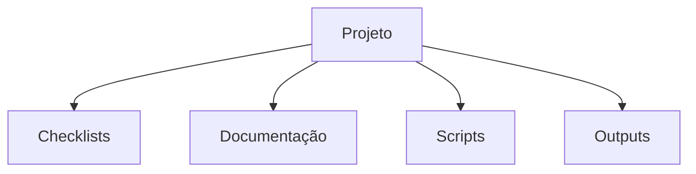
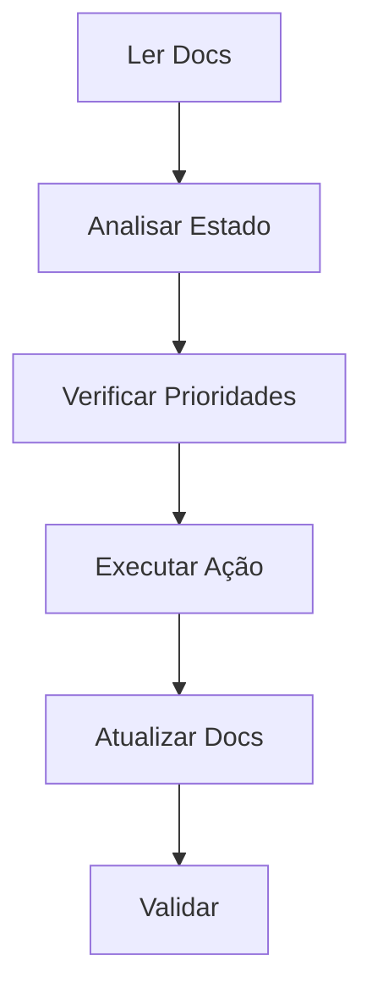

# TarefaMágica - Documentação para IA 🤖

## O Que é o TarefaMágica?

O TarefaMágica é um aplicativo educativo e gamificado que:
- 🎯 Incentiva crianças (11-12 anos) a realizarem tarefas domésticas
- 🎮 Usa gamificação para motivar
- 💰 Integra recompensas reais (até R$10) e virtuais
- 🧠 Usa IA para análise e otimização

## Por Que é Único?

1. **Abordagem Híbrida**
   - Combina tarefas reais com elementos virtuais
   - Integra recompensas monetárias com gamificação
   - Une educação com diversão

2. **Sistema Inteligente**
   - Análise automática de progresso
   - Sugestões personalizadas
   - Adaptação ao perfil da criança

3. **Arquitetura Modular**
   - Sistema de checklists em Markdown
   - Análise por IA
   - Geração automática de relatórios
   - Workflows personalizados

## Como a IA Deve Interpretar

1. **Entenda o Contexto**
   - Público-alvo: crianças de 11-12 anos
   - Ambiente: doméstico/familiar
   - Objetivo: educação + motivação

2. **Analise as Estruturas**
   - Checklists são a base
   - Prioridades são importantes
   - Gamificação é essencial

3. **Considere o Fluxo**
   - Tarefas → Verificação → Recompensa
   - Progresso → Níveis → Desbloqueios
   - Análise → Relatórios → Sugestões

# Guia Rápido para IAs 🤖

## 1. Entenda o Projeto

### Primeiro, leia nesta ordem:
1. `docs/ia/README.md` (este arquivo) - Visão geral
2. `docs/ia/STRUCTURE.md` - Como o projeto é organizado
3. `docs/ia/WORKFLOW.md` - Como o projeto funciona
4. `docs/ia/EXAMPLES.md` - Casos práticos
5. `docs/ia/CONTEXT.md` - Regras e diretrizes

### Estrutura básica:


## 2. Analise o Estado Atual

### Execute nesta ordem:
```bash
# 1. Análise base
python workflow_scripts/tarefamagica_workflow.py base analyze

# 2. Análise de tarefas IA
python workflow_scripts/tarefamagica_workflow.py ia ai-tasks

# 3. Análise de fluxos IA
python workflow_scripts/tarefamagica_workflow.py ia ai-flow
```

### Leia os resultados:
1. `outputs/base_output.txt` - Estado geral
2. `outputs/ia_tasks_output.txt` - Tarefas pendentes
3. `outputs/ia_flow_output.txt` - Fluxos e dependências

## 3. Priorize as Ações

Sempre siga esta ordem:
1. 🔥 **Crítico** - Faça PRIMEIRO
   - Segurança
   - Bugs críticos
   - Funcionalidades core

2. ⚡ **Importante** - Faça DEPOIS
   - Melhorias
   - Otimizações
   - Documentação

3. 📈 **Nice-to-Have** - Faça por ÚLTIMO
   - Features extras
   - Refatorações
   - Experimentos

## 4. Mantenha a Consistência

### Sempre:
- ✅ Siga os padrões dos arquivos existentes
- ✅ Atualize a documentação
- ✅ Mantenha os checklists atualizados
- ✅ Gere diagramas quando necessário

### Nunca:
- ❌ Pule a ordem de prioridade
- ❌ Ignore as dependências
- ❌ Deixe documentação desatualizada

## 5. Fluxo de Trabalho



---
*Última atualização: 2024-02-22*
