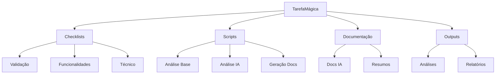
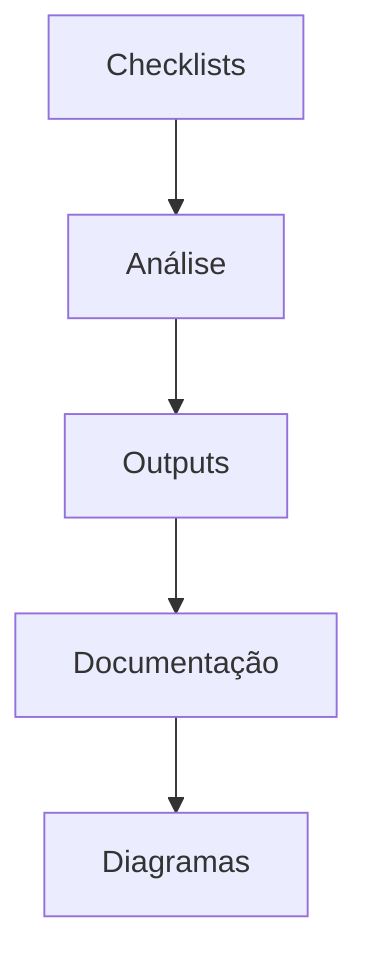

# Estrutura do Projeto 🏗️

## Visão Geral

## 1. Checklists 📋
- `CHECKLIST_Geral_Validacao.md` - Validação geral
- `CHECKLIST_Funcionalidades.md` - Features principais
- `CHECKLIST_Tecnico.md` - Aspectos técnicos
- `CHECKLIST_DevOps.md` - Infraestrutura
- `CHECKLIST_Seguranca.md` - Segurança

## 2. Scripts ⚙️
- `tarefamagica_workflow.py` - Script principal
- `checklist_analyzer.py` - Análise de checklists
- `workflow_ia.py` - Análise por IA
- `diagram_generator.py` - Geração de diagramas

## 3. Documentação 📚
- `/docs/ia/` - Guias para IA
- `/docs/resumo/` - Resumos do projeto

## 4. Outputs 📊
- `base_output.txt` - Análise base
- `ia_tasks_output.txt` - Tarefas de IA
- `ia_flow_output.txt` - Fluxos de IA

## Dependências Principais

## Como Navegar

1. Comece pelos checklists
2. Execute os scripts de análise
3. Verifique os outputs
4. Atualize a documentação
5. Gere os diagramas

---
*Última atualização: 2024-02-22*
