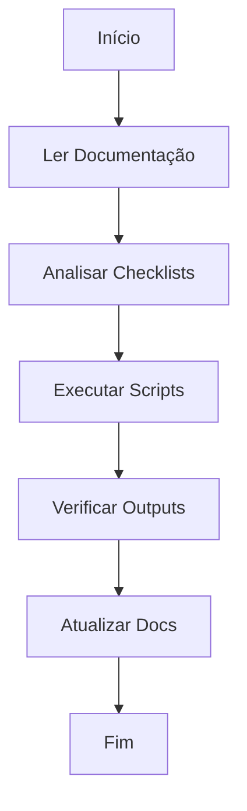
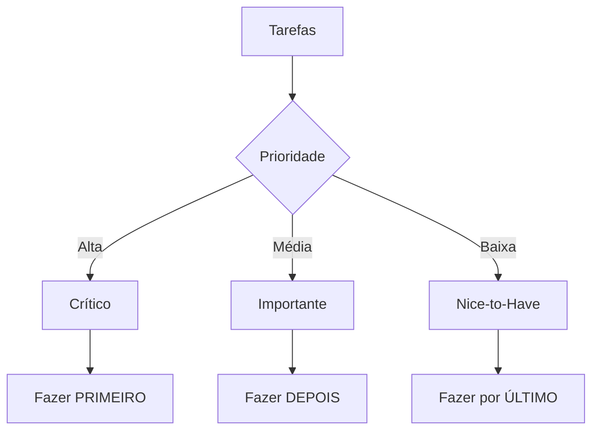

# Workflow para IAs 🔄

## Fluxo Principal



## 1. Como Começar 🚀

### Leia a Documentação
1. `README.md` - Visão geral
2. `STRUCTURE.md` - Estrutura
3. `WORKFLOW.md` - Este arquivo
4. `EXAMPLES.md` - Exemplos
5. `CONTEXT.md` - Contexto

### Execute as Análises
```bash
# Análise completa
python workflow_scripts/tarefamagica_workflow.py base analyze

# Análise de IA
python workflow_scripts/tarefamagica_workflow.py ia ai-tasks
python workflow_scripts/tarefamagica_workflow.py ia ai-flow
```

## 2. Entenda os Outputs 📊

### Arquivos Gerados
- `base_output.txt` - Estado atual
- `ia_tasks_output.txt` - Tarefas
- `ia_flow_output.txt` - Fluxos

### Diagramas Atualizados
- README.md - Estrutura do projeto
- ROADMAP.md - Planejamento futuro

## 3. Prioridades 🎯



## 4. Checklist Rápido ✅

Antes de cada ação:
- [ ] Li a documentação relevante?
- [ ] Executei as análises necessárias?
- [ ] Verifiquei as prioridades?
- [ ] Entendi as dependências?

Depois de cada ação:
- [ ] Atualizei os checklists?
- [ ] Gerei novos outputs?
- [ ] Atualizei a documentação?
- [ ] Gerei os diagramas?

## 5. Dicas Importantes 💡

1. **Sempre**:
   - Siga as prioridades
   - Mantenha documentação atualizada
   - Gere diagramas quando necessário

2. **Nunca**:
   - Pule etapas de análise
   - Ignore dependências
   - Deixe documentação desatualizada

---
*Última atualização: 2024-02-22*
